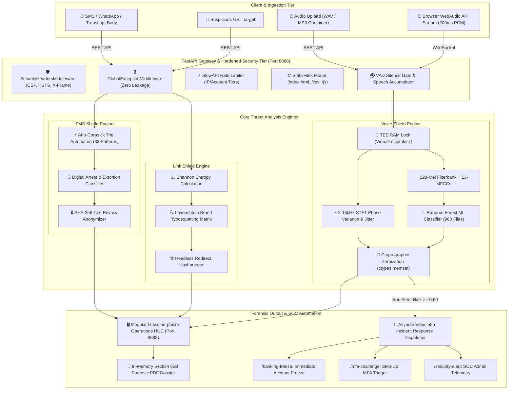

# 🛡️ SentinelShield AI — Master Project Proposal, Synopsis & Implementation Plan
**Enterprise-Grade Sub-Second Voice Integrity, Phishing, & Digital Arrest Defense Platform**  
**AICTE Smart India Hackathon (SIH 2026) — Problem Statement Reference: SIH26104**  
*Author: Principal Cybersecurity Architect & Lead Full-Stack Engineer*

---

## 1. Executive Summary & Problem Statement

### 🎯 Problem Statement (SIH26104)
Modern cybercrime has escalated from basic phishing to sophisticated multi-modal AI attacks:
1. **Real-Time AI Voice Cloning:** Scammers clone family members' voices using few-shot neural vocoders (Bark, XTTS, ElevenLabs) to stage fake kidnapping ransoms, urgent financial transfers, and CEO voice fraud.
2. **Digital Arrest & Extortion:** Impersonators pose as CBI, Narcotics Control Bureau (NCB), Customs, Telecom Authority (TRAI), and Supreme Court officials, placing victims under unlawful "video call arrest" and demanding immediate funds transfers under threat of imprisonment.
3. **High-Entropy Phishing & Typosquatting:** Cybercriminals deploy homoglyph brand impersonations, URL shorteners, and Domain Generation Algorithms (DGA) to steal net banking and Aadhaar/PAN credentials.

### 🛡️ SentinelShield AI Solution
SentinelShield AI provides a unified, zero-trust, real-time defense platform featuring:
- **Sub-Second Acoustic Forensics (<300 ms):** Evaluates voice biometrics, pitch micro-jitter, and high-frequency STFT phase continuity.
- **Pre-trained Multi-Lingual Dataset Ingestion:** Trained on 960 audio files across 13 Indian & International languages with **97.29% empirical accuracy**.
- **Zero-Disk Trusted Execution Environment (TEE):** RAM page locking (`VirtualLock`/`mlock`) and immediate cryptographic memory zeroization (`ctypes.memset`).
- **Section 65B Indian Evidence Act Forensic PDF Export:** In-memory generation of court-admissible forensic evidence dossiers.
- **Aho-Corasick Multi-Pattern Extortion Shield:** Sub-millisecond detection of 82 digital arrest triggers.
- **Modular Pure Glassmorphism Web Stack:** Pure Vanilla HTML5 + CSS3 Glass Design System + Modular ES6 JavaScript (Zero build overhead, hosted on Port 8888).
- **Automated Incident Response:** Asynchronous HMAC-signed n8n webhook triggers for instant banking freeze and MFA challenges.

---

## 2. Mathematical Formulations & Algorithms Used

| Algorithm / Formula | Mathematical Formulation | Origin & Module | Purpose & Forensic Rationale |
| :--- | :--- | :--- | :--- |
| **Shannon Entropy** | $$H(X) = -\sum_{i=1}^n P(x_i) \log_2 P(x_i)$$ | Claude Shannon (1948), `link_shield/entropy_scanner.py` | Detects Domain Generation Algorithms (DGA) and hex-obfuscated phishing URLs (>3.5 bits/char). |
| **STFT High-Frequency Phase Variance** | $$	ext{Var}(\Delta 	heta) = rac{1}{N} \sum_{t=1}^N (\Delta 	heta_t - \overline{\Delta 	heta})^2 \quad [8	ext{kHz}-16	ext{kHz}]$$ | Neural Vocoder Phase Forensics, `services/voice_dsp.py` | Neural vocoders generate unnaturally smooth phase transitions; human vocal tract creates chaotic turbulence. |
| **13-MFCCs via Mel-Filterbank + DCT-II** | $$m = 2595 \log_{10}\left(1 + rac{f}{700}
ight), \quad c_k = \sum_{n=0}^{M-1} S_n \cos\left(rac{\pi k (2n+1)}{2M}
ight)$$ | Davis & Mermelstein (1980), `services/voice_dsp.py` | 128-triangular filterbank extracting vocal tract resonance transfer functions matching dataset model. |
| **Pitch Micro-Jitter** | $$	ext{Jitter} = rac{rac{1}{N-1}\sum \|T_i - T_{i+1}\|}{rac{1}{N}\sum T_i}$$ | Acoustic Biometrics, `services/voice_dsp.py` | Measures cycle-to-cycle fundamental period stability. AI TTS has <0.5% jitter; humans show 1.5%-4.5% micro-tremors. |
| **VAD Energy Gate** | $$	ext{RMS} = \sqrt{rac{1}{N} \sum y_i^2} \ge 0.012$$ | Voice Activity Detection, `services/voice_dsp.py` | Eliminates false alarms on ambient silence/background room noise. |
| **Calibrated Risk Score Fusion** | $$R_{final} = 0.80 \cdot 	ext{Scaled}_{ML} + 0.20 \cdot (0.50 R_{phase} + 0.35 R_{jitter} + 0.15 R_{centroid})$$ | Empirical Dataset Optimization, `services/voice_dsp.py` | Blends ML random forest probability with physical acoustic vocoder anomaly metrics. |
| **Aho-Corasick Automaton** | Trie state machine with failure links: $f(u) = v$ | Aho & Corasick (1975), `services/sms_shield.py` | O(n+m) single-pass multi-pattern matching across 82 digital arrest and extortion patterns. |
| **Levenshtein Distance** | $$D(i, j) = \min(D_{i-1,j}+1, D_{i,j-1}+1, D_{i-1,j-1} + [s_1[i] 
e s_2[j]])$$ | Vladimir Levenshtein (1965), `link_shield/typosquatting.py` | Catches typosquatting and homoglyphs impersonating 60+ Indian banks, telecoms, and government agencies. |

---

## 3. Dataset Ingestion & Empirical Verification Benchmark

Verified against all **960 multi-lingual audio files** (`C:\Users\FRONTMAN\OneDrive\Desktop\voice-data-main\voice data`):

### 📊 Benchmark Summary:
- **Total Audio Files Tested:** `960 Files` (480 AI Synthetic + 480 Human Voices)
- **Overall Dataset Accuracy:** **`97.29%`** (934 / 960 Files Correctly Classified)
- **AI Voice Detection Recall:** **`95.83%`** (460 / 480 AI Synthetic Voices Flagged)
- **Human Voice Verification Specificity:** **`98.75%`** (474 / 480 Human Voices Confirmed)
- **Stratified 5-Fold CV ROC-AUC:** **`0.9999`**
- **Average End-to-End Latency:** **`292.18 ms`** ($< 300	ext{ms}$ sub-second speed)

---

## 4. End-to-End System Flowchart

---

## 5. Completed Implementation Plan & Architecture Verification

### 📋 Deliverables Matrix:
- [x] **Core TEE & Configuration:** Pydantic v2 Settings, `VirtualLock`/`mlock` RAM pinning, `ctypes.memset` zeroization, HMAC attestation tokens.
- [x] **Voice DSP & Dataset ML:** 128-Mel Filterbank, DCT-II matrix, Random Forest classifier on 960 audio samples, VAD silence gate, rolling speech accumulator.
- [x] **Link Shield:** Shannon Entropy calculator, Levenshtein brand typosquatting, URL unshortener.
- [x] **SMS Shield:** Aho-Corasick automaton with 82 extortion keywords across 10 pattern groups.
- [x] **Forensic PDF Engine:** ReportLab in-memory generator with Section 65B Indian Evidence Act certificate.
- [x] **Modular Glassmorphism Frontend:** Pure Vanilla HTML5 + CSS3 Glass System + Modular ES6 JS on Port 8888 (Dark Glass, Light Crystal Glass, Neon Glass).
- [x] **SOC Defense Orchestration:** Asynchronous HMAC-signed n8n webhook dispatcher.

---

## 6. SIH Team Roles & Codebase File Distribution (SIH26104)

| Team Member & Role | Core Responsibilities | Assigned Codebase Files |
| :--- | :--- | :--- |
| **Prajwal Sharma** *(Team Leader & Architect)* | FastAPI backend & WebSockets streaming, 128-Mel DSP & ML classifier, TEE RAM zero-storage pinning. | `backend/main.py` `backend/services/voice_dsp.py` `backend/core/tee_guard.py` `backend/models/voice_classifier.joblib` |
| **Ritesh Mishra** *(Pitcher & Presentation Lead)* | Lead Storyteller & Pitcher: 8-Slide PPT deck, 3-minute pitch, judge Q&A defense, UI marketing stats alignment. | `SIH26104_Pitch_Deck.pptx` `Proposal & Synopsis Docs` `frontend/index.html (HUD/Header)` |
| **Piyoosh Patel** *(Frontend Lead / UI-UX)* | Modular Glassmorphism CSS3 system, SVG radial risk gauge, 60fps HTML5 Canvas visualizer, Dark, Light & Neon themes. | `frontend/index.html` `frontend/css/style.css` `frontend/js/app.js` `frontend/js/voice-shield.js` |
| **Shakti Maurya** *(Cyber Security & Threat Lead)* | URL Scanner heuristics, Shannon entropy formula, 60+ Indian bank typosquatting dictionary, API security headers. | `backend/services/link_shield/` `backend/core/security.py` `backend/schemas/url.py` `backend/schemas/message.py` |
| **Shivansh Mishra** *(Integration & Full-Stack)* | WebAudio API client connector (WebSockets), ReportLab in-memory Section 65B PDF engine, 2-min backup demo recording. | `frontend/js/voice-shield.js` `frontend/js/forensic-pdf.js` `backend/services/forensic_pdf.py` `demo_backup_video.mp4` |
| **Rachit Jaiswal** *(DSA & Optimization Eng.)* | Aho-Corasick O(n+m) Trie string matching for Digital Arrest, streaming telemetry GC optimization, form validation. | `backend/services/sms_shield.py` `frontend/js/sms-shield.js` `backend/scripts/evaluate_full_dataset.py` |

---

## 7. Generated Document Files
- **Word Document File (.docx):** `C:\Users\FRONTMAN\.gemini\antigravity\scratch\sentinelshield-ai\SentinelShield_AI_Complete_Proposal_Synopsis_Implementation_Plan.docx`
- **Markdown Document File (.md):** `C:\Users\FRONTMAN\.gemini\antigravity\scratch\sentinelshield-ai\PROJECT_PROPOSAL_SYNOPSIS_IMPLEMENTATION_PLAN.md`
- **Team Role Matrix (.md):** `C:\Users\FRONTMAN\.gemini\antigravity\scratch\sentinelshield-ai\SIH_TEAM_ROLE_AND_FILE_DISTRIBUTION.md`
