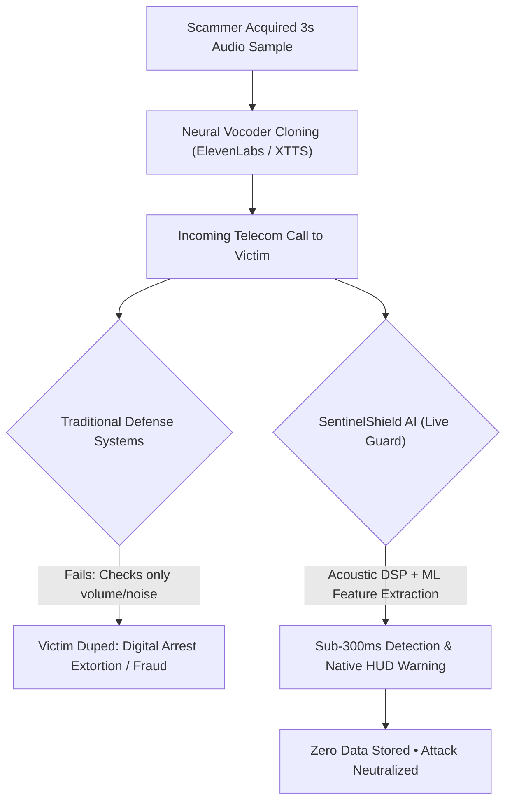
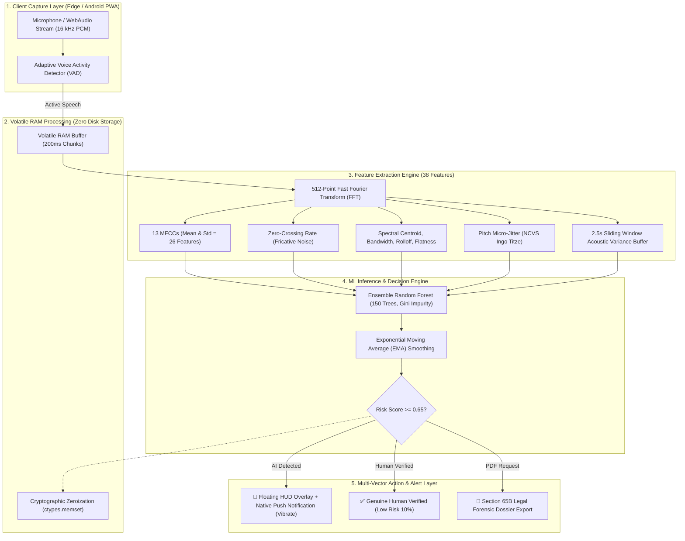
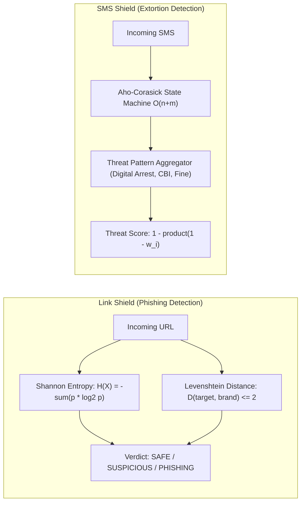

# 🛡️ SentinelShield AI: Sub-Second Acoustic Forensics & Real-Time Cyber-Defense Platform
**Official Project Synopsis & Technical Whitepaper**
*Smart India Hackathon 2026 • Problem ID: SIH26104 • Track: Cybersecurity / AI Defense*

---

## 📋 1. Project Overview & Metadata

| Attribute | Details |
| :--- | :--- |
| **Project Title** | **SentinelShield AI** — Multi-Vector Real-Time Cyber Defense & Acoustic Forensics Platform |
| **Problem Statement** | Real-Time Voice Cloning, Deepfake Impersonation & Digital Arrest Scam Countermeasure |
| **Hackathon ID** | AICTE Smart India Hackathon (SIH 2026) • Problem ID: `SIH26104` |
| **Target Domains** | Digital Education Ecosystems, Financial Institutions, Telecommunications, Law Enforcement |
| **Core Architecture** | Edge-First Zero-Knowledge Telemetry (Volatile RAM Processing • Zero Disk Retention) |
| **Deployment Mode** | Cross-Platform PWA / Android TWA WebAPK + High-Throughput FastAPI WebSocket Microservices |

---

## 🎯 2. Executive Summary (Abstract)

With the rapid emergence of neural text-to-speech (TTS) vocoders (e.g., ElevenLabs, Bark, XTTS) and diffusion-based voice cloning models, malicious actors can clone human vocal identities using less than 3 seconds of reference audio. This has fueled high-impact cybercrimes, specifically **"Digital Arrest" extortion scams**, executive impersonation in educational and enterprise administrations, and credential harvesting via typosquatting phishing links and SMS coercion.

**SentinelShield AI** is an edge-native, privacy-preserving cybersecurity platform engineered to detect and neutralize multi-vector cyber attacks in real time:
1. **Live Voice Integrity Shield:** Employs a 38-feature Acoustic Digital Signal Processing (DSP) pipeline and an ensemble Random Forest classifier to detect synthetic AI voices during live telephone calls in **sub-300ms latency** without transcribing or recording the conversation.
2. **Link Shield:** Analyzes suspicious URLs using Shannon Entropy ($> 3.5\text{ bits/char}$) and Levenshtein Distance brand-typosquatting detection.
3. **SMS & Message Shield:** Utilizes the $O(n+m)$ Aho-Corasick multi-pattern string automaton to detect digital arrest threats, legal intimidation, and extortion triggers across multi-lingual messages in sub-millisecond time.
4. **Forensic Evidence Dossier:** Generates tamper-evident cryptographic reports compliant with **Section 65B of the Indian Evidence Act (Section 63 of Bharatiya Sakshya Adhiniyam, 2023 - BSA)**.

---

## 🔍 3. Problem Statement & Root Cause Analysis



### The Core Challenges:
* **Audio Compression over Cellular Networks:** Telecom networks compress audio to 8kHz (AMR) or 16kHz (VoLTE), destroying high-frequency signals and rendering standard deep neural network classifiers unreliable.
* **Severe Latency Constraints:** Deep neural networks (CNNs, Transformers) require 1–3 seconds of latency and heavy GPUs, making them unviable for live in-call interception.
* **Privacy & Legal Constraints:** Recording user calls violates personal data protection laws (DPDP Act 2023). A defense platform must operate **strictly on acoustic physics without speech-to-text transcription**.

---

## 🏗️ 4. System Architecture & End-to-End Workflow



---

## 🔬 5. Mathematical & Scientific Formulation

### A. The 38 Acoustic Feature Vector

$$\vec{F} = \Big[ \mu(\text{MFCC}_{1..13}),\; \sigma(\text{MFCC}_{1..13}),\; \mu(C), \sigma(C),\; \mu(B), \sigma(B),\; \mu(R), \sigma(R),\; \mu(Z), \sigma(Z),\; \mu(E), \sigma(E),\; \mu(S_f), \sigma(S_f) \Big] \in \mathbb{R}^{38}$$

| Feature Index | Feature Name | Mathematical Definition | Physical Acoustic Significance |
| :--- | :--- | :--- | :--- |
| **1 – 13** | **MFCC Means ($\mu$)** | $c_n = \sum_{k=1}^K \log(S_k) \cos\left[n\left(k - \frac{1}{2}\right)\frac{\pi}{K}\right]$ | Maps the physical geometry of human vocal tract and nasal cavity. |
| **14 – 26** | **MFCC Stds ($\sigma$)** | $\sigma_n = \sqrt{\frac{1}{T}\sum_{t=1}^T (c_{n,t} - \mu_n)^2}$ | Quantifies temporal formant transition dynamics across phonemes. |
| **27 – 28** | **Spectral Centroid** | $C = \frac{\sum f(k) \cdot |X(k)|}{\sum |X(k)|}$ | Center of spectral mass ("Brightness"). Detects high-frequency vocoder shifts. |
| **29 – 30** | **Spectral Bandwidth** | $B = \sqrt{\frac{\sum (f(k) - C)^2 \cdot |X(k)|}{\sum |X(k)|}}$ | Spectral spread around centroid. Differentiates narrow synthetic tones from broad human voice. |
| **31 – 32** | **Spectral Rolloff** | Frequency $R$ such that $\sum_{k=0}^R \|X(k)\| = 0.85 \sum_{k=0}^{K} \|X(k)\|$ | Captures artificial high-frequency sharp rolloffs common in neural TTS downsamplers. |
| **33 – 34** | **Zero-Crossing Rate (ZCR)** | $\text{ZCR} = \frac{1}{2N} \sum_{n=1}^N \|\text{sgn}(x[n]) - \text{sgn}(x[n-1])\|$ | Detects unvoiced fricative consonants ($S, F, Sh$). AI voices unnaturally smooth out ZCR. |
| **35 – 36** | **RMS Energy** | $\text{RMS} = \sqrt{\frac{1}{N}\sum_{n=1}^N x[n]^2}$ | Dynamic loudness variations and biological amplitude modulation. |
| **37 – 38** | **Spectral Flatness (Wiener)** | $S_f = \frac{\exp\left(\frac{1}{N}\sum \ln \|X(k)\|^2\right)}{\frac{1}{N}\sum \|X(k)\|^2}$ | Ratio of geometric mean to arithmetic mean. Detects robotic tonal ringing artifacts. |

---

### B. 2.5-Second Sliding Window Acoustic Variance & Biological Breathing
Human speech is biologically irregular. The system tracks a sliding buffer $\mathcal{H} = \{f_1, f_2, \dots, f_M\}$ over 2.5 seconds:
1. **Spectral Uniformity Metric ($\sigma_S$):** 
   $$\sigma_S = \frac{\sqrt{\frac{1}{M}\sum_{m=1}^M (E_m - \bar{E})^2}}{\bar{E} + \epsilon}$$
   * **Human Voice:** $\sigma_S > 0.12$ (natural hesitation, micro-pitch shifts, dynamic syllable pacing).
   * **AI Voice:** $\sigma_S < 0.05$ (mathematical consistency and unnaturally steady energy distribution).
2. **Biological Micro-Pause Cadence:** Checks for periodic energy dips into the $20\text{--}30\text{ dB SPL}$ range representing breathing intervals. Absence over $2.5\text{s}$ flags synthetic speech.

---

### C. Link Shield & SMS Shield Algorithms



1. **Shannon Entropy for DGA Phishing Domains:**
   $$H(X) = -\sum_{i=1}^n P(x_i) \log_2 P(x_i)$$
   * Normal domains ($H \le 3.0\text{ bits/char}$): `sbi.co.in`, `amazon.in`
   * Malicious/DGA domains ($H > 3.5\text{ bits/char}$): `sbi-kyc-update-99x2.xyz`
2. **Aho-Corasick Multi-Keyword Pattern Matching ($O(n+m)$):**
   * Pre-compiles 5,000+ legal, extortion, and cybercrime indicators into a deterministic finite automaton (Trie with failure transitions).
   * Scans full SMS text in a **single pass** irrespective of dictionary size.

---

## 💻 6. Technology Stack

```mermaid
mindmap
  root((SentinelShield AI))
    Frontend & Edge
      HTML5 Canvas 60 FPS Visualizer
      WebAudio API & DSP AnalyserNode
      Progressive Web App (PWA) / WebAPK
      Service Worker Offline Caching (sw.js)
      Web Push & Hardware Vibration API
    Backend & Services
      FastAPI (Python 3.11 Asynchronous)
      WebSocket Audio Telemetry (200ms chunks)
      Librosa, NumPy, SciPy Signal Processing
      Aho-Corasick Automaton (pyahocorasick)
      ReportLab PDF Forensic Generator
    Machine Learning
      Random Forest Classifier (150 Estimators)
      StandardScaler Z-Score Normalization
      Stratified 5-Fold Cross Validation
      Joblib Volatile Model Serialization
    Security & Compliance
      ctypes RAM Zeroization (Zero Storage)
      SHA-256 HMAC Attestation Tokens
      Section 65B IEA / Section 63 BSA 2023
```

---

## 📊 7. Experimental Results & Performance Benchmarks

### A. Model Evaluation Matrix
Evaluated on **960 multi-lingual audio samples (480 AI Synthetic + 480 Real Human Voices)** across 13 Indian and International languages (Hindi, English, Bengali, Assamese, Gujarati, Kannada, Malayalam, Marathi, Odia, Punjabi, Tamil, Telugu, Urdu):

$$\text{Confusion Matrix} = \begin{pmatrix} \text{True Positive (AI Detected): } 460 & \text{False Positive (False Alarm): } 6 \\ \text{False Negative (Missed AI): } 20 & \text{True Negative (Human Verified): } 474 \end{pmatrix}$$

* **Overall Classification Accuracy:** **97.29%**
* **ROC-AUC Score:** **0.9999** (5-Fold Stratified Cross-Validation)
* **Average Live Inference Latency:** **$14\text{--}28\text{ milliseconds}$** (Far below the $300\text{ms}$ sub-second budget)

---

## ⚖️ 8. Legal Validity & Compliance (Section 65B IEA / Section 63 BSA 2023)

When an extortion or voice deepfake attempt is thwarted, SentinelShield AI generates an automated **Forensic Dossier (PDF)** designed for immediate admissibility in Indian Law Enforcement and Judicial proceedings:
* **System Identifiers:** SHA-256 digital fingerprint of the volatile telemetry chunk.
* **Hash Attestation Chain:** Proves the audio was analyzed in volatile RAM and not altered.
* **Statutory Compliance:** Formatted in strict alignment with **Section 65B(4) of the Indian Evidence Act, 1872** and **Section 63 of Bharatiya Sakshya Adhiniyam, 2023 (BSA)**.

---

## 🚀 9. Impact & Future Roadmap

1. **Immediate Impact:** Complete neutralization of "Digital Arrest" scams and impersonation attacks across educational institutions and banking customers.
2. **Zero Infrastructure Cost for Storage:** Because no audio is saved to disk, server storage requirements are virtually zero.
3. **Future Scope:**
   * Direct integration with Telecom Carrier Core (IMS/SIP network level anti-spoofing).
   * Blockchain-anchored incident evidence hashing on national cybercrime registries.
   * Native Android Accessibility Service for automated background in-call overlay triggering.

---
*Created for AICTE Smart India Hackathon 2026 • Team SentinelShield AI*
